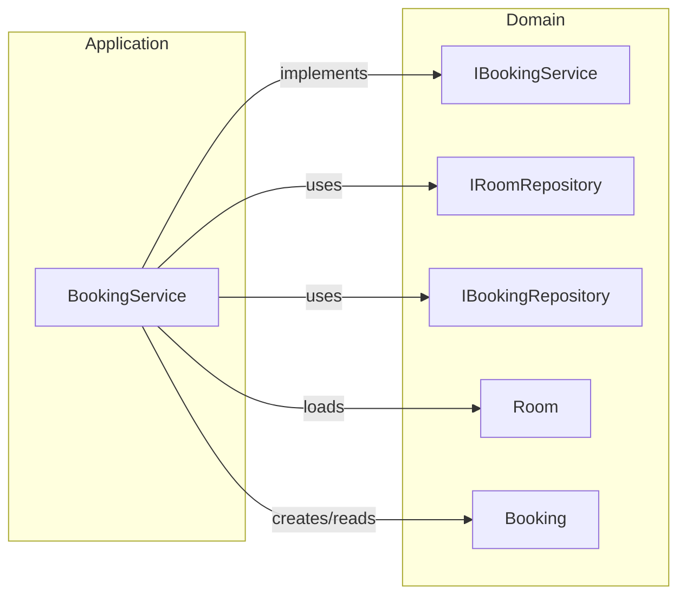

# C4 Code — Application Layer

## Overview

| Field | Value |
|-------|-------|
| **Name** | Application Services |
| **Location** | [Meeting-Room-Booking-API.Application/Services/](../Meeting-Room-Booking-API.Application/Services/) |
| **Language** | C# 12 / .NET 8.0 |
| **Purpose** | Implements business use-case orchestration. Coordinates domain entities and repositories to fulfil application features. No infrastructure or framework dependencies. |

---

## Code Elements

### `BookingService`
**File:** [BookingService.cs](../Meeting-Room-Booking-API.Application/Services/BookingService.cs)  
**Implements:** `IBookingService`

| Method | Signature | Description |
|--------|-----------|-------------|
| Constructor | `BookingService(IRoomRepository, IBookingRepository)` | Injects both repositories via DI. |
| `BookRoomAsync` | `Task<Booking> BookRoomAsync(Guid roomId, string bookedBy, DateTime startTime, DateTime endTime)` | Loads the room (with bookings), calls `Room.AddBooking()` which enforces conflict detection, then persists. Throws `KeyNotFoundException` if room not found; `InvalidOperationException` if time slot is taken. |
| `GetBookingsByRoomAsync` | `Task<IEnumerable<Booking>> GetBookingsByRoomAsync(Guid roomId)` | Verifies the room exists, then returns all bookings via `IBookingRepository`. |
| `CancelBookingAsync` | `Task<bool> CancelBookingAsync(Guid bookingId)` | Looks up the booking by ID; deletes it if found. Returns false if not found (no exception). |

### `DependencyInjection` (Application)
**File:** [DependencyInjection.cs](../Meeting-Room-Booking-API.Application/DependencyInjection.cs)

| Method | Signature | Description |
|--------|-----------|-------------|
| `AddApplication` | `static IServiceCollection AddApplication(this IServiceCollection services)` | Registers `BookingService` as `IBookingService` with scoped lifetime. |

---

## Dependencies

### Internal
- `Domain.Entities` — `Booking`, `Room`
- `Domain.Interfaces` — `IRoomRepository`, `IBookingRepository`, `IBookingService`

### External
- None (no framework or infrastructure dependencies).

---

## Relationships

