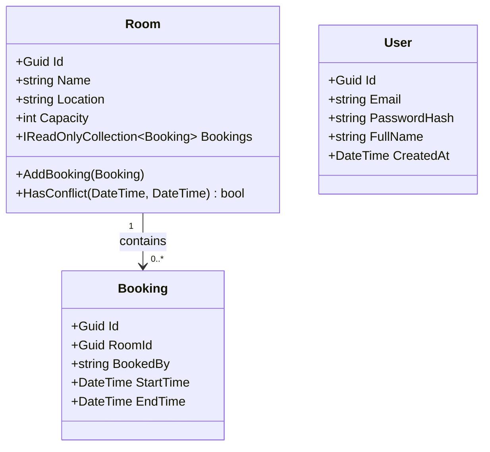

# C4 Code — Domain/Entities

## Overview

| Field | Value |
|-------|-------|
| **Name** | Domain Entities |
| **Location** | [Meeting-Room-Booking-API.Domain/Entities/](../Meeting-Room-Booking-API.Domain/Entities/) |
| **Language** | C# 12 / .NET 8.0 |
| **Purpose** | Core business objects. Encapsulate state, invariants, and domain rules. Zero external dependencies. |

---

## Code Elements

### `Room`
**File:** [Room.cs](../Meeting-Room-Booking-API.Domain/Entities/Room.cs)

| Member | Signature | Description |
|--------|-----------|-------------|
| Constructor | `Room(string name, string location, int capacity)` | Creates a room; throws `ArgumentException` if name is blank or capacity ≤ 0. |
| `AddBooking` | `void AddBooking(Booking booking)` | Adds a booking after checking for overlap via `HasConflict`; throws `InvalidOperationException` on conflict. |
| `HasConflict` | `bool HasConflict(DateTime startTime, DateTime endTime)` | Returns true when `[startTime, endTime)` intersects any existing booking. |
| `Id` | `Guid Id { get; private set; }` | Auto-generated unique identifier. |
| `Name` | `string Name { get; private set; }` | Display name of the room. |
| `Location` | `string Location { get; private set; }` | Physical location string. |
| `Capacity` | `int Capacity { get; private set; }` | Maximum number of attendees. |
| `Bookings` | `IReadOnlyCollection<Booking> Bookings` | Read-only view of this room's bookings. |

---

### `Booking`
**File:** [Booking.cs](../Meeting-Room-Booking-API.Domain/Entities/Booking.cs)

| Member | Signature | Description |
|--------|-----------|-------------|
| Constructor | `Booking(Guid roomId, string bookedBy, DateTime startTime, DateTime endTime)` | Creates a booking; validates that roomId is not empty, bookedBy is not blank, and endTime > startTime. |
| `Id` | `Guid Id { get; private set; }` | Auto-generated unique identifier. |
| `RoomId` | `Guid RoomId { get; private set; }` | FK reference to the parent room. |
| `BookedBy` | `string BookedBy { get; private set; }` | Name of the person who made the booking. |
| `StartTime` | `DateTime StartTime { get; private set; }` | Start of the booked time slot (UTC). |
| `EndTime` | `DateTime EndTime { get; private set; }` | End of the booked time slot (UTC). |

---

### `User`
**File:** [User.cs](../Meeting-Room-Booking-API.Domain/Entities/User.cs)

| Member | Signature | Description |
|--------|-----------|-------------|
| Constructor | `User(string email, string passwordHash, string fullName)` | Creates a user; validates all three fields are non-empty; normalises email to lowercase. |
| `Id` | `Guid Id { get; private set; }` | Auto-generated unique identifier. |
| `Email` | `string Email { get; private set; }` | Normalised (lowercase, trimmed) email address. |
| `PasswordHash` | `string PasswordHash { get; private set; }` | BCrypt hash of the user's password. |
| `FullName` | `string FullName { get; private set; }` | Display name (trimmed). |
| `CreatedAt` | `DateTime CreatedAt { get; private set; }` | UTC timestamp of account creation. |

---

## Dependencies

### Internal
- None — Entities have zero inward dependencies.

### External
- None — Pure C# records/classes only.

---

## Relationships

