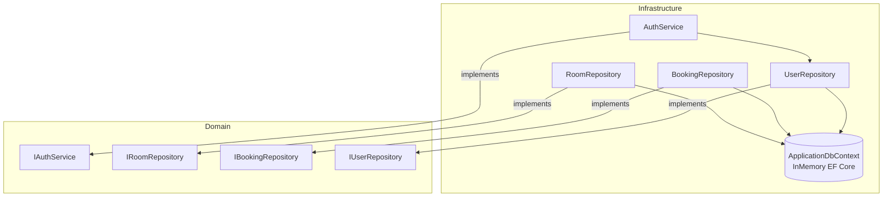

# C4 Code — Infrastructure Layer

## Overview

| Field | Value |
|-------|-------|
| **Name** | Infrastructure (Data Access & Auth) |
| **Location** | [Meeting-Room-Booking-API.Infrastructure/](../Meeting-Room-Booking-API.Infrastructure/) |
| **Language** | C# 12 / .NET 8.0 |
| **Purpose** | Implements all repository interfaces using EF Core (InMemory database) and the authentication service using JWT. Bridges domain contracts to concrete technology. |

---

## Code Elements

### `AuthService`
**File:** [Services/AuthService.cs](../Meeting-Room-Booking-API.Infrastructure/Services/AuthService.cs)  
**Implements:** `IAuthService`

| Method | Signature | Description |
|--------|-----------|-------------|
| Constructor | `AuthService(IUserRepository, IConfiguration)` | Injects repository and configuration. |
| `RegisterAsync` | `Task<(AuthResponse Auth, string RefreshToken)> RegisterAsync(RegisterRequest request)` | Hashes password with BCrypt (workFactor=12), creates a `User`, persists it, returns a token pair. |
| `LoginAsync` | `Task<(AuthResponse Auth, string RefreshToken)> LoginAsync(LoginRequest request)` | Loads user by email, verifies BCrypt hash, returns a token pair. |
| `RefreshAsync` | `Task<(RefreshResponse Refresh, string NewRefreshToken)> RefreshAsync(string refreshToken)` | Validates refresh JWT with `Jwt:RefreshKey`, loads user by sub claim, issues a rotated token pair. |
| `GenerateAccessToken` *(private)* | `string GenerateAccessToken(User user, out DateTime expiresAt)` | Creates a 15-minute HMAC-SHA256 JWT signed with `Jwt:Key`. Claims: `sub`, `email`, `name`, `jti`, `iat`. |
| `GenerateRefreshToken` *(private)* | `string GenerateRefreshToken(Guid userId)` | Creates a 7-day HMAC-SHA256 JWT signed with `Jwt:RefreshKey`. Claims: `sub`, `jti`. |
| `ValidateRefreshToken` *(private)* | `Guid ValidateRefreshToken(string refreshToken)` | Full token validation with `ClockSkew=Zero`. Returns userId (`sub`) on success; throws `UnauthorizedAccessException` on failure. |
| `BuildTokenPair` *(private)* | `(AuthResponse, string) BuildTokenPair(User user)` | Generates and bundles both tokens into a tuple. |

---

### `RoomRepository`
**File:** [Repositories/RoomRepository.cs](../Meeting-Room-Booking-API.Infrastructure/Repositories/RoomRepository.cs)  
**Implements:** `IRoomRepository`

| Method | Signature | Description |
|--------|-----------|-------------|
| `GetAllAsync` | `Task<IEnumerable<Room>> GetAllAsync()` | Returns all rooms without bookings. |
| `GetByIdAsync` | `Task<Room?> GetByIdAsync(Guid id, bool includeBookings = false)` | Returns a room, optionally calling `.Include(r => r.Bookings)`. |
| `AddAsync` | `Task AddAsync(Room room)` | Adds and saves a new room. |
| `UpdateAsync` | `Task UpdateAsync(Room room)` | Marks as modified and saves. |
| `DeleteAsync` | `Task DeleteAsync(Guid id)` | Finds and removes a room by ID. |

---

### `BookingRepository`
**File:** [Repositories/BookingRepository.cs](../Meeting-Room-Booking-API.Infrastructure/Repositories/BookingRepository.cs)  
**Implements:** `IBookingRepository`

| Method | Signature | Description |
|--------|-----------|-------------|
| `GetByRoomIdAsync` | `Task<IEnumerable<Booking>> GetByRoomIdAsync(Guid roomId)` | Returns all bookings matching the roomId. |
| `GetByIdAsync` | `Task<Booking?> GetByIdAsync(Guid id)` | Finds a booking by primary key. |
| `DeleteAsync` | `Task DeleteAsync(Guid id)` | Finds and removes a booking. |

---

### `UserRepository`
**File:** [Repositories/UserRepository.cs](../Meeting-Room-Booking-API.Infrastructure/Repositories/UserRepository.cs)  
**Implements:** `IUserRepository`

| Method | Signature | Description |
|--------|-----------|-------------|
| `GetByEmailAsync` | `Task<User?> GetByEmailAsync(string email)` | Case-insensitive email lookup. |
| `GetByIdAsync` | `Task<User?> GetByIdAsync(Guid id)` | EF Core `FindAsync` by primary key. |
| `ExistsByEmailAsync` | `Task<bool> ExistsByEmailAsync(string email)` | Efficient `AnyAsync` check for duplicate emails. |
| `AddAsync` | `Task AddAsync(User user)` | Persists a new user. |

---

### `ApplicationDbContext`
**File:** [Data/ApplicationDbContext.cs](../Meeting-Room-Booking-API.Infrastructure/Data/ApplicationDbContext.cs)

| Member | Type | Description |
|--------|------|-------------|
| `Rooms` | `DbSet<Room>` | EF Core set for room persistence. |
| `Bookings` | `DbSet<Booking>` | EF Core set for booking persistence. |
| `Users` | `DbSet<User>` | EF Core set for user persistence. |

EF Core Fluent Configuration applied via `IEntityTypeConfiguration<T>` files in `Data/Configurations/`.

---

### `DependencyInjection` (Infrastructure)
**File:** [DependencyInjection.cs](../Meeting-Room-Booking-API.Infrastructure/DependencyInjection.cs)

Registers:
- `ApplicationDbContext` with EF Core InMemory provider
- `RoomRepository` → `IRoomRepository` (Scoped)
- `BookingRepository` → `IBookingRepository` (Scoped)
- `UserRepository` → `IUserRepository` (Scoped)
- `AuthService` → `IAuthService` (Scoped)

---

## Dependencies

### Internal
- `Domain.Entities` — Room, Booking, User
- `Domain.Interfaces` — all repository and service interfaces

### External
| Package | Purpose |
|---------|---------|
| `Microsoft.EntityFrameworkCore.InMemory` | In-memory database for persistence |
| `Microsoft.IdentityModel.Tokens` | JWT creation and validation |
| `System.IdentityModel.Tokens.Jwt` | `JwtSecurityTokenHandler` |
| `BCrypt.Net-Next` | Password hashing (`workFactor=12`) |
| `Microsoft.Extensions.Configuration` | `IConfiguration` for JWT secrets |

---

## Relationships

