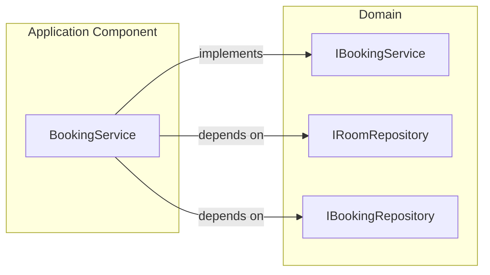

# C4 Component — Application Component

## Overview

| Field | Value |
|-------|-------|
| **Name** | Application |
| **Type** | Library (use-case orchestration) |
| **Technology** | C# 12 / .NET 8.0 class library |
| **Description** | Implements the application-level use cases. Orchestrates domain entities and repository contracts to deliver business features. Contains no direct framework dependencies beyond `Microsoft.Extensions.DependencyInjection`. |

---

## Purpose

The Application component is the **use-case layer** of the Clean Architecture. It:
- Coordinates domain objects (Rooms, Bookings) through repository interfaces
- Enforces the full booking workflow (load room → check conflict → persist)
- Registers itself into the DI container via `AddApplication()`

It does **not** control HTTP, databases, or authentication — those concerns belong to outer layers.

---

## Software Features

| Feature | Description |
|---------|-------------|
| **Book a Room** | Loads the room aggregate with bookings, calls `Room.AddBooking()` which applies conflict detection, then persists. |
| **List Bookings** | Returns all bookings for a given room; verifies the room exists first. |
| **Cancel a Booking** | Looks up and removes a booking by ID; returns `false` (not an exception) if not found. |

---

## Code Elements

| File | Description |
|------|-------------|
| [c4-code-application-services.md](c4-code-application-services.md) | BookingService + DI registration |

---

## Interfaces

| Interface | Protocol | Operations |
|-----------|----------|------------|
| `IBookingService` | In-process | `BookRoomAsync`, `GetBookingsByRoomAsync`, `CancelBookingAsync` (see [Domain Interfaces](c4-code-domain-interfaces.md)) |

---

## Dependencies

### Components Used
- **Domain** — `IRoomRepository`, `IBookingRepository`, `IBookingService`, `Booking`, `Room`

### External Systems
- None.

---

## Component Diagram

