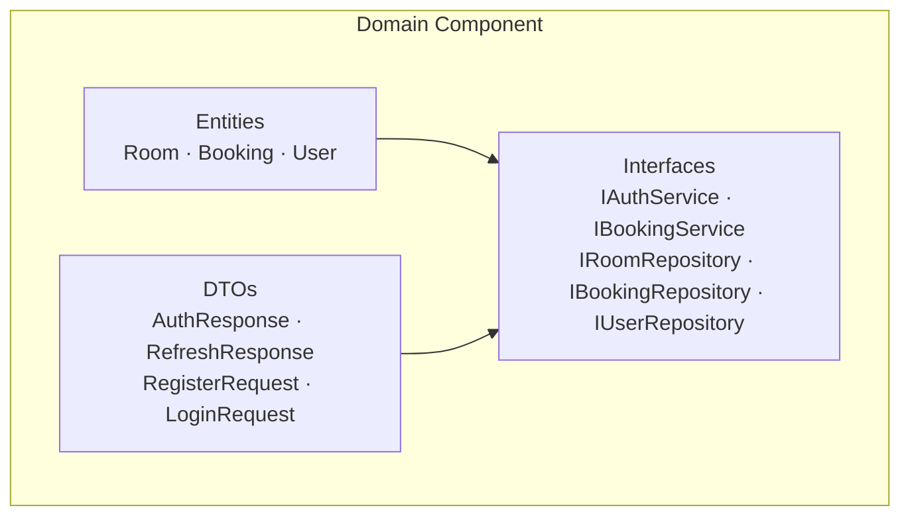

# C4 Component — Domain Component

## Overview

| Field | Value |
|-------|-------|
| **Name** | Domain |
| **Type** | Library (no runtime process) |
| **Technology** | C# 12 / .NET 8.0 class library |
| **Description** | The innermost layer of the Clean Architecture. Contains all business entities, invariant rules, repository contracts, service contracts, and shared DTOs. Has **zero external dependencies** — no framework references. |

---

## Purpose

The Domain component is the **core of the system** and the single source of truth for:
- Business rules (e.g. a room cannot be double-booked)
- Entity identity and lifecycle (auto-generated GUIDs)
- Contracts that all outer layers must fulfil (interfaces)
- Shared data shapes (DTOs) used by controllers and services

It is independent — it can be compiled and tested without any database, HTTP framework, or infrastructure.

---

## Software Features

| Feature | Description |
|---------|-------------|
| **Room Aggregate** | Manages a room and its bookings; enforces overlap detection on `AddBooking`. |
| **Booking Value Object** | Immutable time-slot record; validates start < end on construction. |
| **User Entity** | Normalises email, stores BCrypt hash reference; validates all fields on construction. |
| **Repository Contracts** | Defines `IRoomRepository`, `IBookingRepository`, `IUserRepository` for data access. |
| **Service Contracts** | Defines `IAuthService`, `IBookingService` for use-case boundaries. |
| **Auth DTOs** | Defines `RegisterRequest`, `LoginRequest`, `AuthResponse`, `RefreshResponse` — the auth API surface. |

---

## Code Elements

| File | Description |
|------|-------------|
| [c4-code-domain-entities.md](c4-code-domain-entities.md) | Entities: Room, Booking, User |
| [c4-code-domain-interfaces.md](c4-code-domain-interfaces.md) | Interfaces & DTOs |

---

## Interfaces

| Interface | Protocol | Operations |
|-----------|----------|------------|
| None (consumed, not exposed) | — | Domain is a library; its interfaces are *contracts*, not endpoints. |

---

## Dependencies

### Components Used
- None.

### External Systems
- None.

---

## Component Diagram

