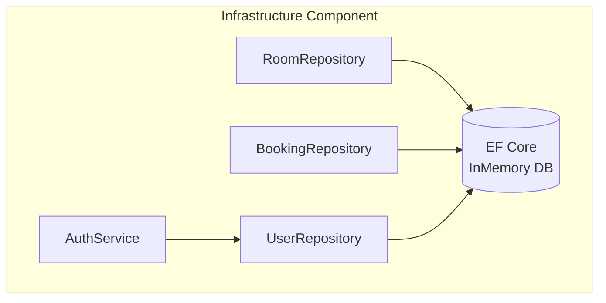

# C4 Component — Infrastructure Component

## Overview

| Field | Value |
|-------|-------|
| **Name** | Infrastructure |
| **Type** | Library (data access & auth) |
| **Technology** | C# 12 / .NET 8.0 · EF Core 8 (InMemory) · BCrypt.Net-Next · System.IdentityModel.Tokens.Jwt |
| **Description** | Implements all Domain contracts against concrete technologies. Provides data persistence via EF Core and authentication via JWT. Plugged in at startup via `AddInfrastructure()`. |

---

## Purpose

The Infrastructure component is the **adapter layer** — it bridges abstract Domain contracts to real technology:
- Persists entities using EF Core (currently InMemory; swap to SQL with a config change)
- Hashes passwords using BCrypt
- Signs and validates JWTs with separate access/refresh signing keys
- Seeds the database with demo data on first startup

---

## Software Features

| Feature | Description |
|---------|-------------|
| **User Registration** | Hashes password (BCrypt, workFactor=12), creates User entity, persists via `UserRepository`. |
| **User Login** | Loads user by email, verifies BCrypt hash, issues access + refresh JWT tokens. |
| **Access Token Generation** | 15-minute HMAC-SHA256 JWT signed with `Jwt:Key`; carries `sub`, `email`, `name`, `jti`, `iat`. |
| **Refresh Token Generation** | 7-day HMAC-SHA256 JWT signed with `Jwt:RefreshKey`; carries only `sub`, `jti`. |
| **Token Rotation** | `RefreshAsync` validates refresh JWT, loads user, issues a new rotated token pair. |
| **Room Persistence** | EF Core CRUD for `Room` aggregate; supports eager-loading of bookings. |
| **Booking Persistence** | EF Core CRUD for `Booking`; query by RoomId. |
| **User Persistence** | EF Core user lookup by email and by ID. |
| **Database Seeding** | Seeds 10 rooms + 50 bookings on first startup via `DatabaseSeeder`. |

---

## Code Elements

| File | Description |
|------|-------------|
| [c4-code-infrastructure.md](c4-code-infrastructure.md) | AuthService, all Repositories, ApplicationDbContext, DI registration |

---

## Interfaces

| Interface Implemented | Protocol | Description |
|----------------------|----------|-------------|
| `IAuthService` | In-process | Register, Login, Refresh |
| `IRoomRepository` | In-process → EF Core | CRUD for rooms |
| `IBookingRepository` | In-process → EF Core | CRUD for bookings |
| `IUserRepository` | In-process → EF Core | CRUD for users |

---

## Dependencies

### Components Used
- **Domain** — all entity and interface types

### External Systems

| System | Type | Purpose |
|--------|------|---------|
| EF Core InMemory Database | In-process database | Stores rooms, bookings, users |
| BCrypt.Net-Next | Library | Password hashing |
| System.IdentityModel.Tokens.Jwt | Library | JWT creation & validation |

---

## Component Diagram

