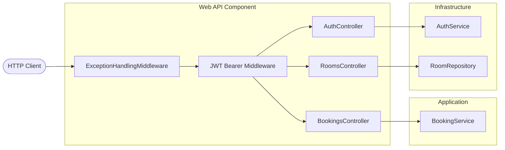

# C4 Component — Web API Component

## Overview

| Field | Value |
|-------|-------|
| **Name** | Web API |
| **Type** | ASP.NET Core Web Application |
| **Technology** | C# 12 / ASP.NET Core 8.0 · Swashbuckle · JwtBearer |
| **Description** | The outermost layer. Receives HTTP requests, authenticates them via JWT Bearer, routes to controllers, and returns HTTP responses. Composes all inner layers at startup. |

---

## Purpose

The Web API component is the **delivery mechanism** — it:
- Exposes RESTful HTTP endpoints for rooms, bookings, and authentication
- Enforces authentication via `[Authorize]` and ASP.NET Core's JWT Bearer middleware
- Issues and rotates JWT tokens (access token in body, refresh token in HttpOnly cookie)
- Handles exceptions globally via `ExceptionHandlingMiddleware`, returning RFC 7807 `ProblemDetails`
- Provides a Swagger/OpenAPI UI for interactive API exploration

---

## Software Features

| Feature | Description |
|---------|-------------|
| **Authentication Endpoints** | Register, Login, Refresh (token rotation), Logout |
| **Room Management** | CRUD for meeting rooms (all protected by JWT) |
| **Booking Management** | Create, list, and cancel bookings (all protected by JWT) |
| **Refresh Token Cookie** | Refresh token set as `HttpOnly`, `Secure`, `SameSite=Strict` cookie (7-day lifetime) |
| **Global Exception Handling** | Maps domain exceptions to appropriate HTTP status codes |
| **Swagger UI** | Interactive API docs with JWT Authorize button at `/swagger` |

---

## Code Elements

| File | Description |
|------|-------------|
| [c4-code-webapi.md](c4-code-webapi.md) | AuthController, RoomsController, BookingsController, Middleware, Program.cs |

---

## Interfaces (HTTP API)

| Endpoint Group | Protocol | Base Path |
|----------------|----------|-----------|
| Auth | REST / HTTPS | `/api/auth` |
| Rooms | REST / HTTPS | `/api/rooms` |
| Bookings | REST / HTTPS | `/api/rooms/{roomId}/bookings` |

Full endpoint details in [c4-container.md](c4-container.md) and [apis/meeting-room-booking-api.yaml](apis/meeting-room-booking-api.yaml).

---

## Dependencies

### Components Used
- **Application** — `IBookingService`
- **Infrastructure** — `IAuthService`, `IRoomRepository` (via DI)
- **Domain** — DTOs and entity types

### External Systems
- None (no outbound external calls from the Web API itself).

---

## Component Diagram

