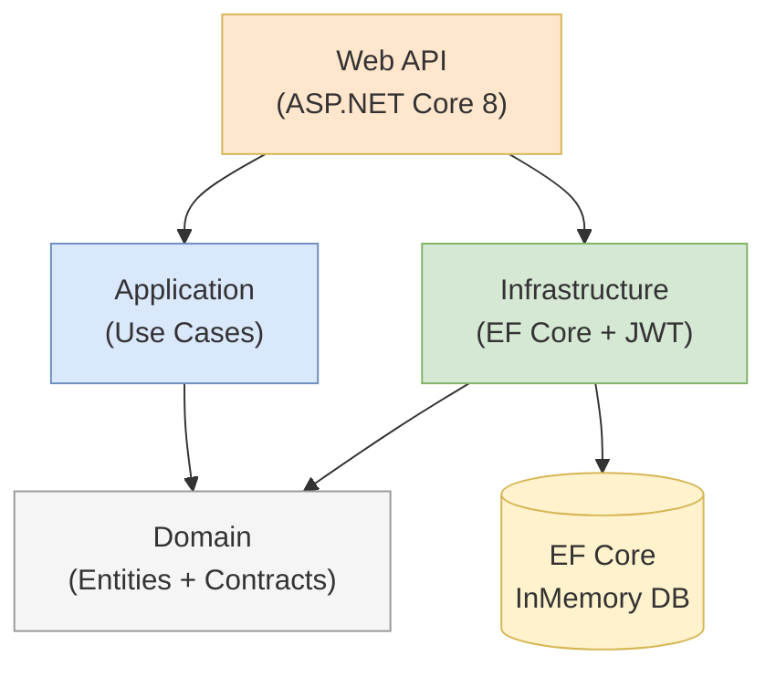

# C4 Component Index — Meeting Room Booking API

## System Components

| Component | Type | Description | Documentation |
|-----------|------|-------------|---------------|
| **Domain** | Class Library | Business entities, invariants, and all contracts. Zero external dependencies. | [c4-component-domain.md](c4-component-domain.md) |
| **Application** | Class Library | Use-case orchestration — booking workflows. Depends only on Domain. | [c4-component-application.md](c4-component-application.md) |
| **Infrastructure** | Class Library | EF Core repositories, JWT auth service, BCrypt, DB seeding. | [c4-component-infrastructure.md](c4-component-infrastructure.md) |
| **Web API** | ASP.NET Core App | HTTP controllers, JWT middleware, Swagger, DI composition root. | [c4-component-webapi.md](c4-component-webapi.md) |

---

## Component Relationship Diagram



---

## Dependency Rule

All dependencies point **inward** toward Domain:

```
WebAPI → Application → Domain
WebAPI → Infrastructure → Domain
```

Domain has **zero** outward dependencies, guaranteeing it can be tested and reasoned about independently.

---

## External System Dependencies

| External System | Used By | Protocol |
|----------------|---------|----------|
| EF Core InMemory Database | Infrastructure | In-process |
| BCrypt.Net-Next | Infrastructure | Library call |
| System.IdentityModel.Tokens.Jwt | Infrastructure | Library call |
| Microsoft.AspNetCore.Authentication.JwtBearer | Web API | HTTPS middleware |
