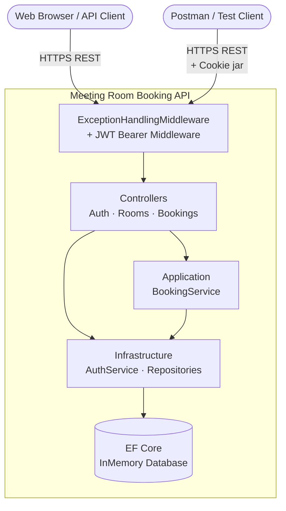

# C4 Container — Meeting Room Booking API

## Overview

This system runs as a **single deployable container**: an ASP.NET Core 8 Web API process. There is no separate database server — persistence is provided by the EF Core InMemory provider running in-process.

---

## Containers

### Container 1: Meeting Room Booking API

| Field | Value |
|-------|-------|
| **Name** | Meeting Room Booking API |
| **Type** | Web API / HTTP Server |
| **Technology** | ASP.NET Core 8.0 (.NET 8) |
| **Deployment** | Single process (dotnet run); no container orchestration currently configured |
| **Port (HTTPS)** | 5001 |
| **Port (HTTP)** | 5000 |

#### Purpose

The sole runtime process. It:
- Hosts all HTTP endpoints (auth, rooms, bookings)
- Validates JWT access tokens on every protected request
- Manages refresh token rotation via HttpOnly cookies
- Persists data in an in-process EF Core InMemory database
- Serves interactive API documentation via Swagger UI at `/swagger`

#### Components Deployed in this Container

| Component | Role |
|-----------|------|
| [Web API](c4-component-webapi.md) | HTTP request handling, routing, middleware |
| [Application](c4-component-application.md) | Business use-case orchestration |
| [Infrastructure](c4-component-infrastructure.md) | Data access (EF Core) and JWT authentication |
| [Domain](c4-component-domain.md) | Business entities, rules, and contracts |

#### Interfaces (HTTP API)

| Group | Method | Path | Auth | Description |
|-------|--------|------|------|-------------|
| **Auth** | POST | `/api/auth/register` | None | Register new user; returns access token + sets refresh cookie |
| **Auth** | POST | `/api/auth/login` | None | Login; returns access token + sets refresh cookie |
| **Auth** | POST | `/api/auth/refresh` | Cookie | Rotate refresh token; returns new access token + new cookie |
| **Auth** | POST | `/api/auth/logout` | Bearer JWT | Clear refresh cookie |
| **Rooms** | GET | `/api/rooms` | Bearer JWT | List all rooms |
| **Rooms** | GET | `/api/rooms/{id}` | Bearer JWT | Get room with bookings |
| **Rooms** | POST | `/api/rooms` | Bearer JWT | Create room |
| **Rooms** | DELETE | `/api/rooms/{id}` | Bearer JWT | Delete room |
| **Bookings** | GET | `/api/rooms/{roomId}/bookings` | Bearer JWT | List room bookings |
| **Bookings** | POST | `/api/rooms/{roomId}/bookings` | Bearer JWT | Create booking (conflict check) |
| **Bookings** | DELETE | `/api/rooms/{roomId}/bookings/{id}` | Bearer JWT | Cancel booking |

Full OpenAPI 3.1 specification: [apis/meeting-room-booking-api.yaml](apis/meeting-room-booking-api.yaml)

#### Dependencies

| Dependency | Type | Communication | Purpose |
|-----------|------|---------------|---------|
| EF Core InMemory | In-process | Library calls | Data persistence |
| BCrypt.Net-Next | In-process | Library calls | Password hashing |
| System.IdentityModel.Tokens.Jwt | In-process | Library calls | JWT sign/validate |

#### Infrastructure

> **Current:** Single process, InMemory database (dev/demo only).  
> **To move to production:** Replace the InMemory provider with SQL Server or PostgreSQL in `DependencyInjection.cs`. Containerise with Docker.

**Suggested Dockerfile pattern (not yet committed):**
```dockerfile
FROM mcr.microsoft.com/dotnet/aspnet:8.0 AS base
WORKDIR /app
EXPOSE 8080

FROM mcr.microsoft.com/dotnet/sdk:8.0 AS build
COPY . .
RUN dotnet publish Meeting-Room-Booking-API/ -c Release -o /app/publish

FROM base AS final
COPY --from=build /app/publish .
ENTRYPOINT ["dotnet", "Meeting-Room-Booking-API.dll"]
```

---

## Container Diagram


