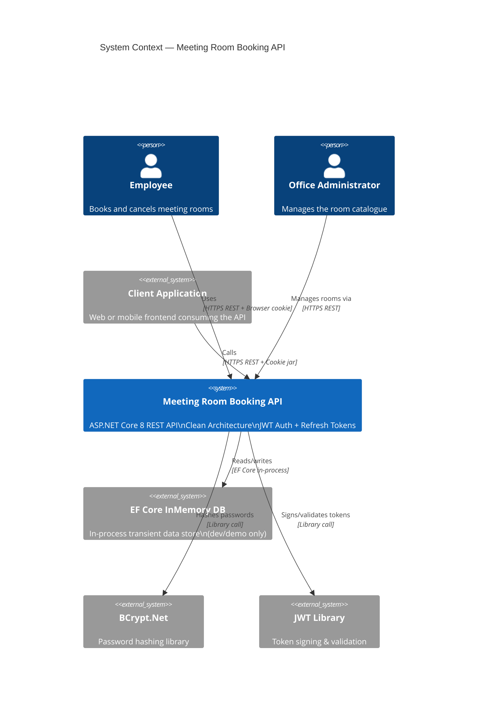

# C4 Context — Meeting Room Booking API

## System Overview

**Short Description:** A RESTful API for reserving time-slots in shared meeting rooms, preventing double-bookings through conflict detection.

**Long Description:** The Meeting Room Booking API allows users and client applications to manage a catalogue of physical meeting rooms and reserve time slots within them. It enforces an invariant that no two bookings for the same room can overlap in time. Users authenticate with email/password and receive a short-lived JWT access token (15 minutes) plus a rotating long-lived refresh token (7 days, delivered via an HttpOnly cookie). All room and booking operations require an authenticated identity. The system is built on Clean Architecture principles, keeping business rules isolated from infrastructure concerns, making it straightforward to swap the in-process InMemory database for a production relational database (SQL Server, PostgreSQL) with minimal changes.

---

## Personas

### Persona 1: Authenticated Employee (Human User)

| Field | Value |
|-------|-------|
| **Name** | Employee |
| **Type** | Human User |
| **Description** | A staff member who needs to reserve a meeting room for a meeting, presentation, or workshop. |
| **Goals** | Find an available room, book it for a specific time slot, and cancel a booking they no longer need. |
| **Key Features Used** | Login, View Rooms, Create Booking, Cancel Booking, Token Refresh |

---

### Persona 2: Office Administrator (Human User)

| Field | Value |
|-------|-------|
| **Name** | Office Administrator |
| **Type** | Human User |
| **Description** | A staff member responsible for managing the pool of available meeting rooms. |
| **Goals** | Add new rooms to the system, remove decommissioned rooms, and view all current bookings. |
| **Key Features Used** | Login, Create Room, Delete Room, View All Bookings |

---

### Persona 3: Frontend Web/Mobile App (Programmatic User)

| Field | Value |
|-------|-------|
| **Name** | Client Application |
| **Type** | Programmatic User (External System) |
| **Description** | A web or mobile frontend that consumes this API on behalf of human users. |
| **Goals** | Register users, manage sessions via token refresh (silently), display rooms and bookings, handle booking creation and cancellation. |
| **Key Features Used** | All endpoints; particularly the refresh token rotation flow for silent session renewal. |

---

## System Features

| Feature | Description | Users |
|---------|-------------|-------|
| **User Registration** | Create a new account with email, full name, and password. | Employee, Admin, Client App |
| **User Authentication** | Login with email/password; receive access + refresh tokens. | Employee, Admin, Client App |
| **Token Refresh** | Silently renew an expired access token using the refresh cookie. | Client App |
| **Room Discovery** | Browse all available meeting rooms with capacity and location. | Employee, Admin, Client App |
| **Room Management** | Create and delete meeting rooms in the system. | Admin, Client App |
| **Booking Creation** | Reserve a specific time slot in a room; system rejects overlapping bookings. | Employee, Client App |
| **Booking Cancellation** | Remove an existing booking to free up the time slot. | Employee, Admin |
| **Booking Visibility** | View all bookings for any given room. | Employee, Admin |

---

## User Journeys

### Journey 1: Employee Books a Room

1. **Login** — POST `/api/auth/login` → receive `accessToken` (body) + `refreshToken` (cookie).
2. **Browse Rooms** — GET `/api/rooms` (Bearer token) → list of rooms and capacities.
3. **Check Availability** — GET `/api/rooms/{id}` → view existing bookings for that room.
4. **Create Booking** — POST `/api/rooms/{id}/bookings` with `bookedBy`, `startTime`, `endTime`.
   - If slot is free → `201 Created` with booking details.
   - If slot is taken → `400 Bad Request` with `ProblemDetails` describing the conflict.
5. **Token Expires** (15 min) → Client automatically calls POST `/api/auth/refresh` → new access token issued + refresh cookie rotated.

---

### Journey 2: Admin Adds a New Room

1. **Login** — POST `/api/auth/login`.
2. **Create Room** — POST `/api/rooms` with `name`, `location`, `capacity` → `201 Created`.
3. **Verify** — GET `/api/rooms/{newId}` → confirm room exists.

---

### Journey 3: Employee Cancels a Booking

1. **Login / Token already valid.**
2. **Find Booking** — GET `/api/rooms/{roomId}/bookings` → identify the booking ID.
3. **Cancel** — DELETE `/api/rooms/{roomId}/bookings/{bookingId}` → `204 No Content`.

---

### Journey 4: Client App Silent Token Refresh

1. Client holds an access token that is close to or past its 15-minute expiry.
2. **Refresh** — POST `/api/auth/refresh` (browser sends `refreshToken` cookie automatically).
3. Receive new `accessToken` (body) + new `refreshToken` cookie (rotation).
4. Client updates its in-memory access token and continues making API calls.
5. If refresh cookie has expired (7 days) → user must log in again.

---

### Journey 5: User Logs Out

1. **Logout** — POST `/api/auth/logout` (with Bearer access token).
2. Server clears the `refreshToken` cookie.
3. Client clears its in-memory access token.
4. Any further call to `/api/auth/refresh` returns `401 Unauthorized`.

---

## External Systems and Dependencies

| System | Type | Description | Integration | Purpose |
|--------|------|-------------|-------------|---------|
| **EF Core InMemory Database** | In-process database | Transient data store for rooms, bookings, users. Resets on restart. | EF Core API | Development/demo persistence |
| **BCrypt.Net-Next** | Library | Industry-standard password hashing with configurable cost factor. | Library call | Secure password storage |
| **System.IdentityModel.Tokens.Jwt** | Library | JWT creation and validation compliant with RFC 7519. | Library call | Stateless authentication |
| **Client Browser / Postman** | External consumer | Sends HTTP requests; browser automatically manages `HttpOnly` cookies. | HTTPS REST | Consuming the API |

> **Production note:** The InMemory database and BCrypt library are the only external runtime dependencies. In a production deployment, EF Core would be swapped to a real RDBMS (SQL Server, PostgreSQL), and the API container would be deployed behind a reverse proxy (nginx, Azure API Management, etc.).

---

## System Context Diagram

---

## Related Documentation

| Document | Description |
|----------|-------------|
| [c4-container.md](c4-container.md) | Container-level view: single deployable process and its HTTP interface |
| [c4-component.md](c4-component.md) | Component index: Domain, Application, Infrastructure, Web API |
| [apis/meeting-room-booking-api.yaml](apis/meeting-room-booking-api.yaml) | Full OpenAPI 3.1 specification |
