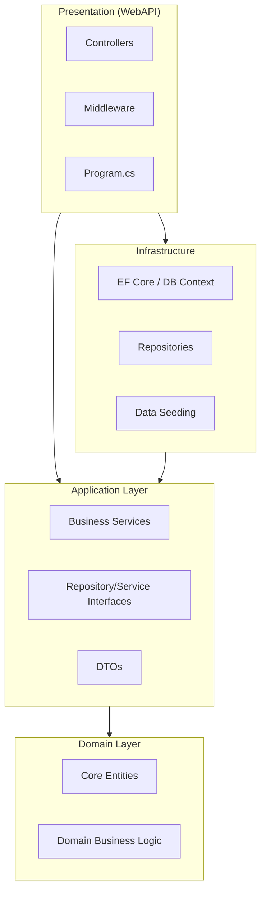

# 🏢 Meeting Room Booking API


A professional, production-ready RESTful API for managing meeting rooms and time-slot bookings, engineered with **ASP.NET Core 8.0** and **Clean Architecture**.

---

## ✨ Features

- **🛡️ Secure Auth**: Dual-token system (JWT Access Tokens + HttpOnly Refresh Cookies).
- **🚀 Ultra-Fast**: Optimized endpoints with built-in Rate Limiting.
- **🏗️ Clean Architecture**: Decoupled layers for maximum testability and maintainability.
- **🐳 Container Ready**: Expert-level Docker & Docker Compose orchestration.
- **🔍 Auto-Documented**: Interactive Swagger UI with full XML documentation.
- **✅ Test Driven**: Comprehensive unit test suite included.

---

## 🏗️ Architecture

The project follows the **Clean Architecture** (Onion Architecture) pattern, ensuring the business logic remains independent of external frameworks.



---

## 🚦 Getting Started

### 📦 Run with Docker (Recommended)

The easiest way to get the API running is using Docker Compose.

```bash
docker compose up -d
```
*The API will be available at `http://localhost:5000`*

### 🔨 Local Development

**Prerequisites:**
- [.NET 8.0 SDK](https://dotnet.microsoft.com/download/dotnet/8.0)

**Steps:**
1. **Clone & Restore**
   ```bash
   git clone <repo-url>
   dotnet restore
   ```
2. **Run Application**
   ```bash
   dotnet run --project Meeting-Room-Booking-API
   ```
   *By default, listens on `https://localhost:5001` (Dev) or `http://localhost:5000` (Release).*

---

## 🔐 Authentication Flow

This API implements a secure rotation-based authentication mechanism.

| Component | Lifecycle | Location |
| :--- | :--- | :--- |
| **Access Token** | 15 Minutes | Bearer Header (`Authorization: Bearer <token>`) |
| **Refresh Token** | 7 Days | `HttpOnly`, `Secure` Cookie (Automatic transport) |

### Refresh Logic
When the access token expires, the client calls `POST /api/auth/refresh`. The browser automatically sends the refresh cookie, and the API returns a new access token while rotating the cookie in the background.

---

## 🔌 API Endpoints

### 🔑 Authentication
- `POST /api/auth/register` - New user signup.
- `POST /api/auth/login` - Authenticate and receive tokens.
- `POST /api/auth/refresh` - Rotate session tokens (Cookie-based).
- `POST /api/auth/logout` - Invalidate session.

### 🏢 Room Management
- `GET /api/rooms` - List all rooms.
- `POST /api/rooms` - Create a new room (Admin).
- `GET /api/rooms/{id}` - Details including current bookings.

### 📅 Booking Logic
- `GET /api/rooms/{id}/bookings` - View schedule.
- `POST /api/rooms/{id}/bookings` - Book a slot (Includes conflict detection).
- `DELETE /api/rooms/{id}/bookings/{id}` - Cancel booking.

---

## ⚙️ Configuration

Key settings are managed via `appsettings.json` or Environment Variables:

| Variable | Description | Default |
| :--- | :--- | :--- |
| `JWT_KEY` | Secret key for Access Token signing | *(Change in Prod)* |
| `JWT_ISSUER` | Token Issuer URL | `https://localhost:5001` |
| `C_ORIGIN` | Allowed CORS Origin | `http://localhost:3000` |

---

## 🧪 Testing

```bash
dotnet test
```
*Note: The Docker build process automatically runs these tests as a verification gate.*

---

## 📜 License

Distributed under the MIT License. See `LICENSE` for more information.
